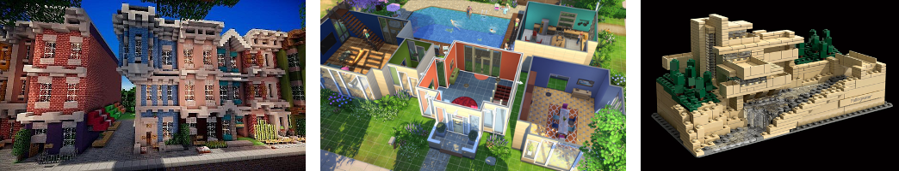

# [BK-7083] Spatial Computing: Computational Design Studio: 2018-19

## Introduction

Spatial Computing (BK-MI-197, 15 ECTS) is offered as a minor degree
programme at TU Delft consisting of a computational design studio
([BK-7083], 9 ECTS) and a computational simulations course ([BK-7084] 6 ECTS).
The goal of this studio [BK-7083] is to introduce a participatory
generative approach to architectural design. In doing so, the course
also introduces basic mathematical and computational skills, especially
in geometry, topology and graph theory (spatial mathematics), which are
necessary for systematic analysis, synthesis, simulation,
decision-making, and optimization in architectural design. We propose
generative design as a feed-forward way of designing in which the form
is systematically derived from functional requirements. The goal of this
studio is not to make a building in a 'parametric style', but to learn
how to develop computational design workflows. Therefore, the focal
points of attention in the course are gamification, programming, and
mathematics for participatory generative design. Thus, the primary
deliverable will be a demonstration of an operational workflow showing
the transformation of a site, a program of requirements, key performance
indicators, and the preferences of the prospective inhabitants into a
building.

## People
<table width=100%>
    <thead >
        <tr class="header">
            <th colspan="2">Instruction Team</th>
        </tr>
    </thead>
    <tbody>
        <tr>
            <td>Course Coordinator</td>
            <td><a href="mailto:p.nourian@tudelft.nl">Dr. Ir. P. Nourian</a></td>
        </tr>
        <tr>
            <td>Instructors</td>
            <td>
                <a href="mailto:p.nourian@tudelft.nl">Dr. Ir. Pirouz Nourian</a> (TU Delft, Design Informatics, PZN) 
                <a href="mailto:S.Azadi-1@tudelft.nl">Ir. Shervin Azadi</a> (TU Delft, Design Informatics, SAZ) 
                <a href="mailto:J.J.J.G.Hoogenboom@tudelft.nl">Ir. Hans Hoogenboom</a> (TU Delft, Design Informatics-HHG) 
            </td>
         </tr>
    </tbody>
    <thead>
        <tr class="header">
            <th colspan="2">Students</th>
        </tr>
    </thead>
    <tbody>
        <tr>
            <td>
                <a href="https://github.com/shervinazadi/spatial_computing_18/tree/master/Accretio">Accretio</a>
            </td>
            <td>
                Maximilian Michl 
            </td>
        </tr>
        <tr>
            <td>
                <a href="https://github.com/shervinazadi/spatial_computing_18/tree/master/Arthouse">Arthouse</a>
            </td>
            <td>
                Marieke van Esch 
                Pim Voermans 
                Valerie van den Broek  
                Laurens van Rijssel   
            </td>
        </tr>
        <tr>
            <td>
                <a href="https://github.com/shervinazadi/spatial_computing_18/tree/master/Het_Gebouw">Het Gebouw</a>
            </td>
            <td>
                Jasper van der Vaart  
                Syed Baqir Ali Kazmi
            </td>
        </tr>
        <tr>
            <td>
                <a href="https://github.com/shervinazadi/spatial_computing_18/tree/master/Piece_of_Cake">Piece of Cake</a>
            </td>
            <td>
                Fé van Lookeren Campagne  
                Ruben Schonewille  
                Max Ketelaar
            </td>
        </tr>
    </tbody>
</table>

## Theme

The theme of the year is redefining design as a game, with rules and
scores. We define a rulebook, specify the moves in the game; devise
automatic scoring mechanisms; and let designers or prospective
inhabitants play the design game almost as LEGO, Minecraft, and Sims .

## Design Challenge

**MICROPOLIS:** You are requested to design a housing complex
incorporating several communal/public facilities for [a cooperative
live-work-play association]{.ul}. A group of graduate students and young
professionals have formed this cooperative to make their own
live-work-play space. The housing complex is to accommodate students,
young graduates (starters), and assisted living. The complex also
provides communal/public facilities, almost as a collective. The program
of requirements lists the spaces below:

- Location: Rotterdam, [The block between Vijverhofstraat,
    Zomerhofstraat, Schoterbosstraat, and
    Teilingerstraat.](https://goo.gl/maps/8PM9Xu1LLL72)\
    The location is split into compulsory and optional development,
    giving the students the option to extend their design if deemed
    necessary (see Figure 1). The part that has to be changed is the big
    multi-functional building, but if required, the old railway line,
    football park, restaurant and green park in the light green areas
    can be incorporated as well. If the design is extended into the
    optional parts, any streets or pathways crossing this region should
    be integrated into the design, without losing their original
    function.

- Housing:
  - Student Housing 80 units
  - Assisted Living 30 units
  - Starter Housing 100 units
- Communal Spaces:
  - Underground Parking (minimum of 0.5 parking lots per apartment)
  - Vegetation (minimum 30% of the plot)
  - Workshops/Fab-Labs/Co-working Space and Start-up Offices
  - Library + Cinematheque + Café/Pub + \[pinball\] Arcade
  - Co-cooking/Restaurant
  - Community Centre
  - Shop (grocery, tools and crafts)
  - Gym

## Design Goals (quantitative & qualitative):

- Maximum Multi-scale Modularity (Qualitative)
- Excellent Ergonomics (Qualitative)
- Keeping at least the same amount of housing units as before
    (Quantitative)
- Not blocking direct light for neighbour buildings (Quantitative)
- Max solar gain potential (optional, Quantitative)
- Max greenery (Quantitative)
- Min noise (Quantitative)
- Social integration (Qualitative)
- Rational spectra of privacy and community (Qualitative)

## Activities & Deliverables

The thematic activities for the weeks are (marked with colours and tags
on the schedules):

- A1) **Planning**: Program of Requirements & Network (adjacency and
    connectivity requirements)
- A2) **Configuring**: Circulation Manifold
- A3) **Massing**: Coloured Voxel Clouds
- **Midterm** (you will work on these items from day one, and will
    present them informally in a pin-up fashion):
    {problem formulation, a plan, a configuration, a mass-void
    composition, a flowchart, a clay model, code snippets & procedural
    models (submitted to our GitLab repo), and a live demo of the
    computational models}
- A4) **Forming**: Spatial Modules (functional spaces designed on a
    grid) fitted into the voxel cloud, finalized form, all models
    cleaned and documented.
- **Final** (you will present as a group):
  - A presentation about your design process (an update on midterm presentation)
  - an animation of the \[interactive\] computational design process.
  - an A2 poster including) and the followings: {architectural diagrams (space planning \[network\], configuration \[circulation manifold\], massing \[voxel cloud\]), functional modules, plans 1:200, sections 1:100, urban plan 1:500, and renderings}

## Syllabus

After completing this course, the student is supposed to have gained 1)
knowledge, 2) insight and 3) skill on the use of mathematical and
computational principles, facts, conventions, and methods/algorithms in
the context of architectural design.

### Theory

The subjects taught in this course are the essentials of:

- Spatial Mathematics: Linear Algebra, Geometry, Topology, and Graph Theory
- Computer Graphics (Boundary Representations and Raster Representations)
- Programming in Python & C# [BK-7083] & C++ [BK-7084]
- Space Planning (i.e. configurative design, determining the 'Space Syntax')
- Grammatical Design (e.g. L-Systems, Graph Grammars, Design Games)
- Evidence-Based Design (e.g. Pattern Language)
- Housing Design (goals, ergonomics, standards, design codes, best
    practices)

### Practice

The practical skills learnt in this minor are the essentials of:

- Modern CAD (Parametric and Procedural Design)
- Simulation (light)
- Generative Design (using Cellular Automata, Agent-Based Modelling, Particle Systems, Combinatorial Design)
- Technical Communication (Problem Definition, Problem Formulation, Flowchart Drawing, Pseudocode Writing)
- Infographics
- Programming (within Rhino & Grasshopper using Python [BK-7083] and
    coding C++ modules [BK-7084])

### License

This work is dual-licensed under MIT and 4.0-CC-BY. The Software is licensed under MIT and all other contents are licensed under 4.0-CC-BY. Each student project has different authors, please refer to AUTHOR file for detailed list of authors per project.

---
<!-- Links -->
[BK-7083]:https://studiegids.tudelft.nl/a101_displayCourse.do?course_id=52471
[BK-7084]:https://studiegids.tudelft.nl/a101_displayCourse.do?course_id=48906
